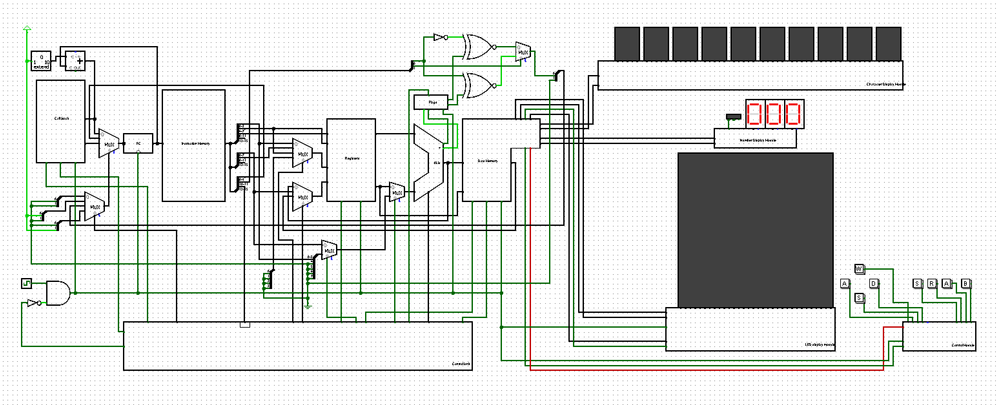

# 8-bit Single-Cycle CPU with 16-bit Instruction Format (Logisim)

## CPU Datapath

## Overview
This project implements a **custom 8-bit single-cycle CPU** designed and built using **Logisim**, with a **16-bit wide instruction format**.  
The CPU was developed from first principles to understand **processor architecture, datapath design, control logic, and peripheral interfacing**, and was extended to drive **custom character and numeric display units using self-designed communication protocols**.

The project emphasizes **architectural clarity and system-level thinking**, rather than HDL implementation, making it a strong demonstration of core computer organization concepts.

---

## Architecture
- **Data width:** 8-bit  
- **Instruction width:** 16-bit  
- **Execution model:** Single-cycle  
- **Design tool:** Logisim  

### Core Components
- Program Counter (PC)
- Instruction Memory
- Register File (8-bit registers)
- Arithmetic Logic Unit (ALU)
- Control Unit
- Data Memory
- Custom I/O Interface Logic

All stages of instruction execution—fetch, decode, execute, memory access, and write-back—are completed within **a single clock cycle**.

---

## Instruction Format
The CPU uses a **16-bit instruction encoding** to support a richer control space while operating on 8-bit data.

Typical instruction fields include:
- Opcode
- Register specifiers
- Immediate / control fields

Instruction decoding is implemented using combinational logic constructed from basic gates and multiplexers within Logisim.

---

## Instruction Set
The processor supports a **custom instruction set inspired by RISC-style architectures**, adapted for an 8-bit datapath.

### Instruction Categories
- Arithmetic and logical operations  
- Register-to-register instructions  
- Immediate-based instructions  
- Control flow instructions (branch and jump)  
- Load and store instructions  

Control signals are generated based on instruction decoding and drive the datapath accordingly.

---

## Custom Display Interface
A key feature of this project is the design of **custom communication protocols** to interface the CPU with:
- A character display unit  
- A numeric display unit  

### Design Highlights
- Proprietary protocols designed specifically for this CPU  
- Explicit control over data framing and timing  
- Dedicated interface logic separated from the CPU core  

This demonstrates an understanding of **protocol design, synchronization, and peripheral control**.

---

## Verification & Testing
- Manual and step-by-step verification of instruction execution in Logisim  
- Observation of internal signals (registers, ALU outputs, control lines)  
- Testing of custom display output for correctness and timing  

The design was verified incrementally at the module level before full system integration.

---

## Tools Used
- **Logisim**

---

## Key Learnings
- Designing an **8-bit processor datapath** with a wider instruction encoding  
- Translating instruction semantics into hardware-level control logic  
- Understanding single-cycle CPU timing and limitations  
- Designing and interfacing custom peripherals using self-defined protocols  

---

## Future Improvements
- Multi-cycle or pipelined version of the CPU  
- Interrupt handling support  
- Expansion of the instruction set  
- Migration to HDL (Verilog) and FPGA implementation  

---

## Author
**Abhinav Krishna**  
Electronics and Communication Engineering Undergraduate  

Interests:
- Digital Electronics & Computer Architecture  
- Embedded Systems  
- Hardware-Aware Cybersecurity
